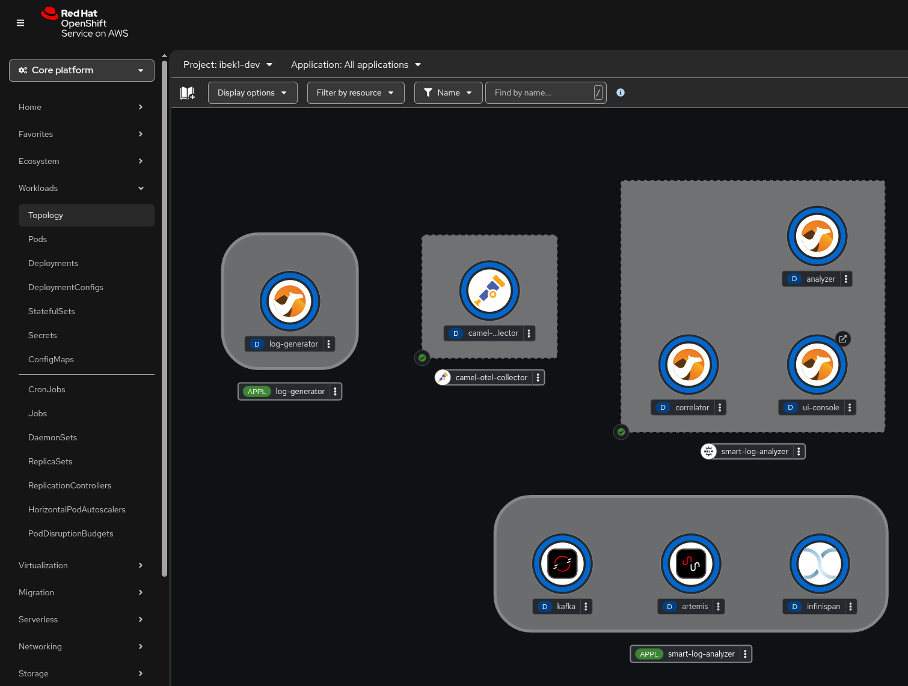
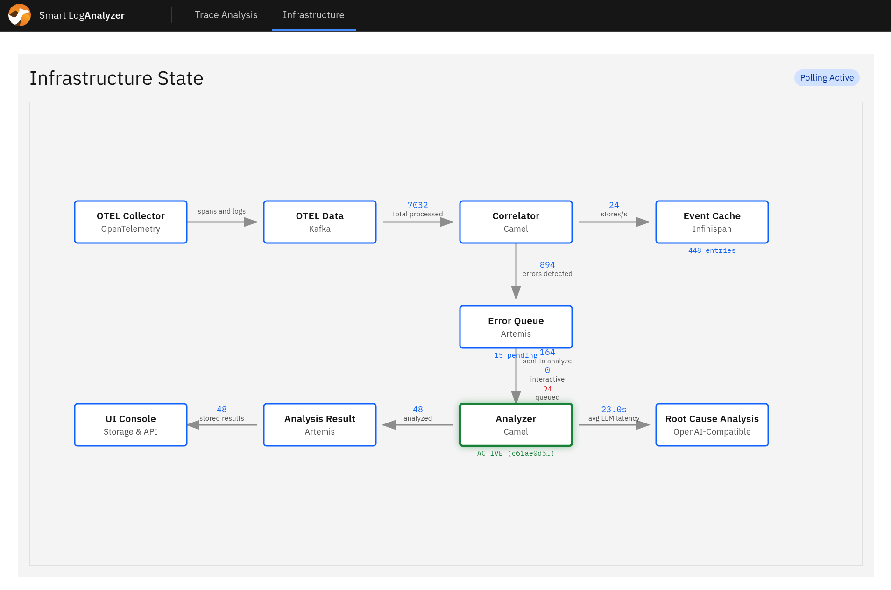
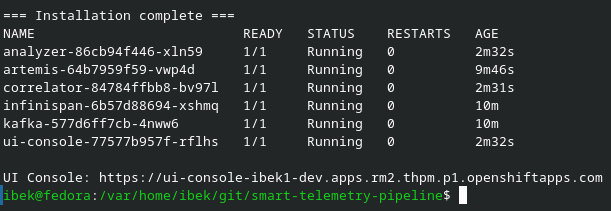
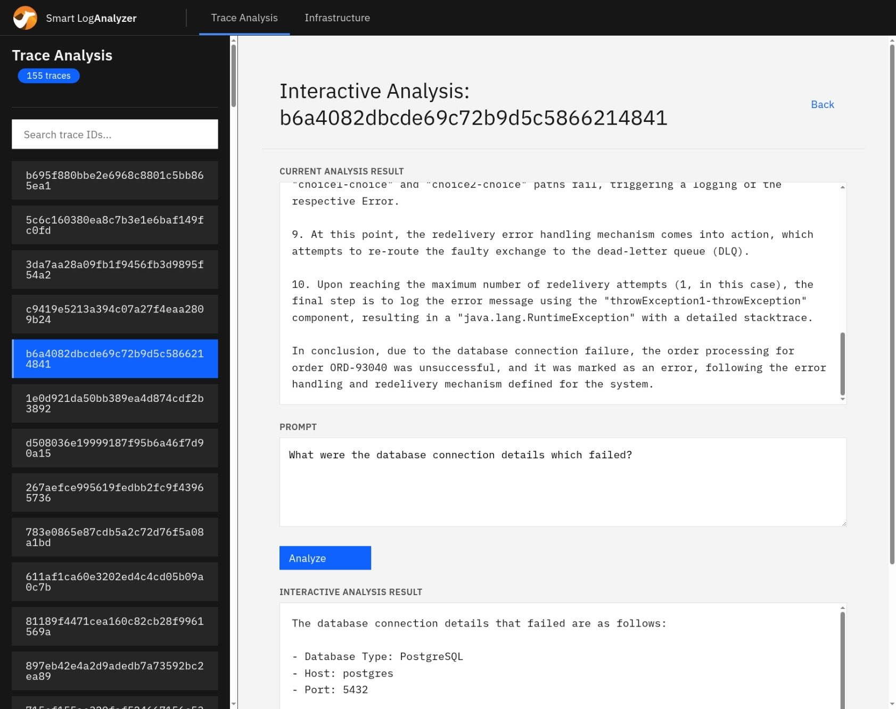

# Power Autonomous Root Cause Analysis for Distributed Systems

Route telemetry through an event-driven pipeline where AI analyzes correlated logs and traces, turning raw signals into actionable root cause analysis.

## Table of contents

1. [Detailed description](#detailed-description)
2. [Requirements](#requirements)
3. [Deploy](#deploy)
4. [References](#references)
5. [Tags](#tags)

## Detailed description

An intelligent observability pipeline that automatically detects microservice errors in distributed applications, correlates logs and traces, and uses GenAI to provide SREs with actionable remediation steps. Built with OpenTelemetry, Kafka, Camel, Artemis, Infinispan and LLMs to dramatically reduce MTTR via AI-assisted diagnostics.

Site Reliability Engineers spend significant time manually sifting through logs and traces to diagnose production incidents. In complex microservice architectures, a single user request can span dozens of services, making root cause analysis slow and error-prone. This pipeline automates that investigation: it continuously ingests OpenTelemetry data, detects errors, correlates related signals by trace ID, and sends the correlated context to an LLM for immediate root cause analysis delivering actionable insights in seconds.

The system consists of three Apache Camel applications deployed on Red Hat® OpenShift®. The **correlator** consumes logs and traces from Kafka and groups them by trace ID in Infinispan. The **analyzer** retrieves correlated events and sends them to a Granite LLM for root cause analysis. The **UI console** stores results and provides a web interface for reviewing analyses and triggering interactive re-analysis with custom prompts.

### Architecture diagrams





## Requirements

### Minimum hardware requirements

No dedicated hardware is required. The application runs entirely within the Red Hat Developer Sandbox, which provides shared compute resources.

### Minimum software requirements

| Component | Version | Notes |
|---|---|---|
| [Red Hat Developer Sandbox](https://developers.redhat.com/developer-sandbox) | OpenShift 4.x with Pipelines | Free hosted cluster with pre-installed Tekton |
| Red Hat OpenShift AI shared models | Granite LLM | Activated via the sandbox landing page |
| `oc` (OpenShift CLI) | 4.x | Download from the OpenShift web console (**?** > **Command line tools**) or [mirror.openshift.com](https://mirror.openshift.com/pub/openshift-v4/clients/ocp/latest/) |
| `helm` | 3.x | [Install guide](https://helm.sh/docs/intro/install/) |
| `tkn` | latest | [Install guide](https://tekton.dev/docs/cli/). Useful for monitoring pipeline runs |
| `git` | any | To clone this repository |

### Required user permissions

Regular sandbox user permissions (no cluster-admin required). All components are deployed as containers within the user's namespace.

## Deploy

### 1. Get access to the Developer Sandbox

1. Go to [https://developers.redhat.com/developer-sandbox](https://developers.redhat.com/developer-sandbox)
2. Click **Start your sandbox for free** and log in with your Red Hat account
3. Complete the registration (phone verification may be required)
4. Once provisioned, click **Start using your sandbox** to open the OpenShift web console

### 2. Activate OpenShift AI models

In the sandbox landing page, find the **OpenShift AI** card and click **Try it**. This provisions the Granite LLM inference service that the analyzer uses for root cause analysis.

### 3. Log in to the cluster

1. In the OpenShift web console, click your username in the top-right corner
2. Select **Copy login command** > **Display Token**
3. Run the `oc login` command in your terminal:

   ```bash
   oc login --token=sha256~XXXX --server=https://api.sandbox-XXXX.openshiftapps.com:6443
   ```

4. Verify your namespace:

   ```bash
   oc project
   ```

   You should see `<username>-dev`.

### 4. Clone and deploy

```bash
git clone https://github.com/rh-ai-quickstart/smart-telemetry-pipeline.git
cd smart-telemetry-pipeline
./create.sh
```

The `create.sh` script automates the full installation: infrastructure (Kafka, OTel Collector, Infinispan, AMQ Broker), OpenAI credentials configuration, application builds via Tekton pipelines, and Helm deployment. It takes approximately 10-15 minutes to complete.

### 5. Verify the deployment

Check that all pods are running:

```bash
oc get pods
```

You should see pods for `kafka`, `infinispan`, `artemis`, `camel-otel-collector`, `correlator`, `analyzer`, and `ui-console`.

Open the UI Console in your browser:



### 6. Generate test data

Deploy the log generator to produce simulated telemetry (orders with a 30% failure rate):

```bash
./log-generator/run.sh
```

Open the UI Console to see AI-generated root cause analyses appearing for the detected errors. Click on a trace to view the detailed analysis for correlated traces and logs, and use interactive prompting to ask follow-up questions about the initial analysis.



To stop generating test data:

```bash
./log-generator/delete.sh
```

### Delete

Remove all deployed resources:

```bash
./delete.sh
```

For manual step-by-step deployment and deletion, see the [Manual Deployment Guide](README_MANUAL_DEPLOYMENT.md).

## References

- [Red Hat build of Apache Camel](https://developers.redhat.com/products/red-hat-build-of-apache-camel)
- [Red Hat Application Foundations](https://www.redhat.com/en/products/application-foundations)

### Additional documentation

- [Manual Deployment Guide](README_MANUAL_DEPLOYMENT.md) — step-by-step infrastructure and application deployment
- [Monitoring and Alerting](README_MONITORING.md) — Prometheus metrics, PromQL queries, and alert configuration
- [Troubleshooting](README_TROUBLESHOOTING.md) — common issues and fixes
- [Technical Details](README_TECHNICAL_DETAILS.md) — component architecture and build pipeline

## Tags

- **Industry:** Media and IT services
- **Product:** Red Hat OpenShift AI + Red Hat Application Foundations
- **Use case:** Observability, automation, AI-assisted diagnostics
- **Contributor org:** Red Hat
