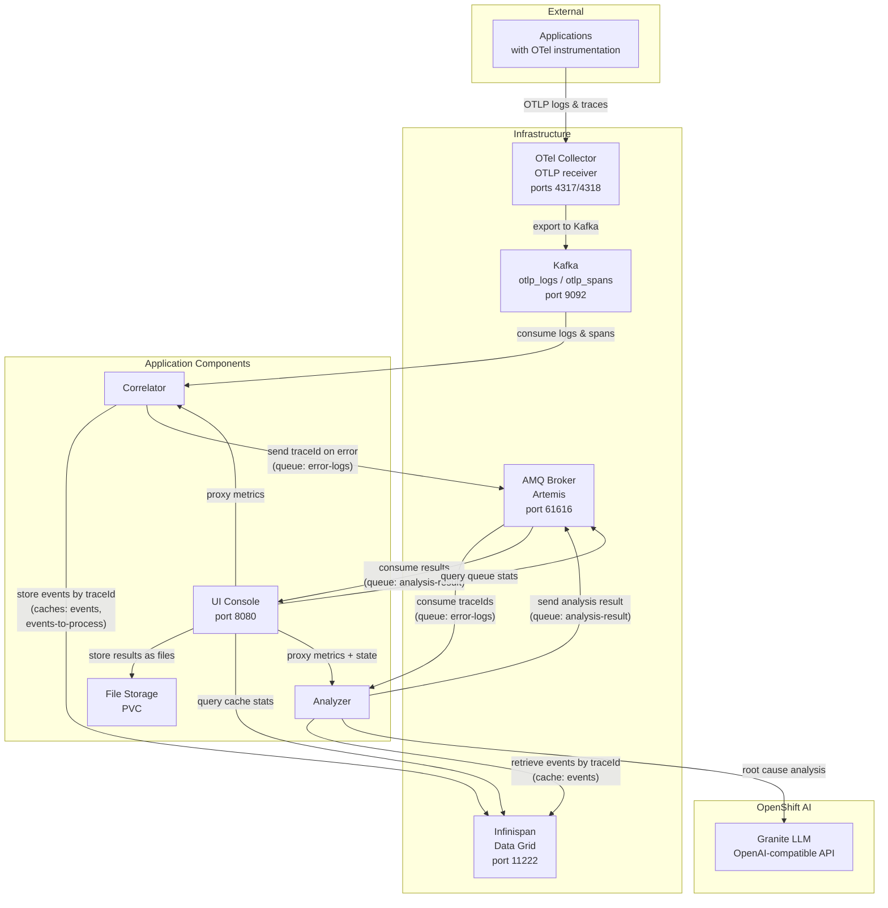
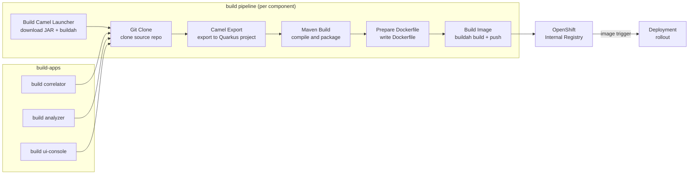

# Smart Telemetry Pipeline

An intelligent observability pipeline that automatically detects microservice errors in distributed applications, correlates logs and traces, and uses GenAI to provide SREs with actionable remediation steps. Built with OpenTelemetry, Kafka, Camel, Artemis, Infinispan and LLMs to dramatically reduce MTTR via AI-assisted diagnostics.

## Table of contents

1. [Architecture](#architecture)
2. [Build Pipeline](#build-pipeline)
3. [Requirements](#requirements)
4. [Get Access to the Developer Sandbox](#get-access-to-the-developer-sandbox)
5. [Install the CLI Tools](#install-the-cli-tools)
6. [Log In to the Cluster](#log-in-to-the-cluster)
7. [Clone This Repository](#clone-this-repository)
8. [Quick Start](#quick-start)
9. [Verify the Installation](#verify-the-installation)
10. [Monitoring and Alerting](#monitoring-and-alerting)
11. [Troubleshooting](#troubleshooting)
12. [Delete](#delete)

## Detailed description

The system consists of three Apache Camel applications that form an automated error analysis pipeline:

- The **correlator** consumes OpenTelemetry logs and spans from Kafka, correlates them by traceId in Infinispan, and detects errors. When cached events expire (after a configurable TTL), the traceId is forwarded to a JMS queue for analysis.

- The **analyzer** picks up traceIds from the JMS queue, retrieves the correlated events from Infinispan, sends them to an LLM (OpenAI-compatible API) for root cause analysis, and publishes the result to an output queue.

- The **ui-console** consumes analysis results, stores them as files, and exposes a REST API and web UI for listing results, viewing trace details, and triggering interactive re-analysis with custom prompts.

### Architecture diagrams



The `build` pipeline converts Camel JBang source code into container images deployed on OpenShift:



The **Build Camel Launcher** step downloads the `camel-launcher` JAR from Maven Central (via `mvn dependency:copy`) and builds it into a container image pushed to the OpenShift internal registry. The version is configurable via the `camel-launcher-version` pipeline parameter (default: `4.20.0`). The **Camel Export** step runs `camel export --runtime=quarkus` using the internally-built camel-launcher image to convert the Camel JBang application into a standard Quarkus Maven project. The **Maven Build** step compiles it into a Quarkus fast-jar. The **Build Image** step uses Buildah to create the container image and push it to the OpenShift internal registry. The `image.openshift.io/triggers` annotation on the Deployment automatically triggers a rollout when a new image is pushed.

## Requirements

### Minimum hardware requirements

No dedicated hardware is required. The application runs entirely within the Red Hat Developer Sandbox, which provides shared compute resources.

### Minimum software requirements

- [Red Hat Developer Sandbox](https://developers.redhat.com/developer-sandbox) (OpenShift with Pipelines pre-installed)
- OpenShift AI shared models activated in the sandbox (Granite LLM)

### Required user permissions

Regular sandbox user permissions (no cluster-admin required). All components are deployed as containers within the user's namespace.

## Get Access to the Developer Sandbox

The Red Hat Developer Sandbox provides a free OpenShift cluster with a pre-provisioned namespace. Key characteristics:

- **No cluster-admin access** -- you cannot install cluster-wide operators or create ClusterRoles
- **Pre-installed operators** -- OpenShift Pipelines (Tekton) is available; other components are deployed as containers
- **Pre-provisioned namespace** -- you use your assigned `<username>-dev` namespace
- **Resource quotas** -- CPU and memory are limited
- **Idle timeout** -- pods may be scaled down after inactivity
- **30-day access** -- the sandbox expires after 30 days (you can re-register)

1. Go to [https://developers.redhat.com/developer-sandbox](https://developers.redhat.com/developer-sandbox)
2. Click **Start your sandbox for free** and log in with your Red Hat account
3. Complete the registration (phone verification may be required)
4. Once provisioned, click **Start using your sandbox** to open the OpenShift web console
5. In the sandbox landing page, find the **OpenShift AI** card and click **Try it** to activate the shared LLM inference services (Granite models). This provisions the models in the `sandbox-shared-models` namespace, which the analyzer component uses for root cause analysis

## Install the CLI Tools

You need the `oc` and `helm` CLIs on your local machine. The `tkn` CLI is optional but useful for monitoring pipeline runs.

### oc (OpenShift CLI)

Download from the OpenShift web console:

1. In the web console, click the **?** icon in the top-right corner
2. Select **Command line tools**
3. Download the `oc` binary for your OS and add it to your `PATH`

Alternatively, download from [mirror.openshift.com](https://mirror.openshift.com/pub/openshift-v4/clients/ocp/latest/).

### helm

```bash
# Linux
curl -fsSL https://raw.githubusercontent.com/helm/helm/main/scripts/get-helm-3 | bash

# macOS
brew install helm

# Windows (with Chocolatey)
choco install kubernetes-helm
```

Or follow the [official install guide](https://helm.sh/docs/intro/install/).

### tkn (optional)

```bash
# Linux
curl -LO https://mirror.openshift.com/pub/openshift-v4/clients/pipelines/latest/tkn-linux-amd64.tar.gz
mkdir -p ~/.local/bin && tar xvf tkn-linux-amd64.tar.gz -C ~/.local/bin/ tkn

# macOS
brew install tektoncd-cli
```

Or follow the [official install guide](https://tekton.dev/docs/cli/).

## Log In to the Cluster

1. In the OpenShift web console, click your username in the top-right corner
2. Select **Copy login command**
3. Click **Display Token**
4. Copy the `oc login` command and run it in your terminal:

   ```bash
   oc login --token=sha256~XXXX --server=https://api.sandbox-XXXX.openshiftapps.com:6443
   ```

5. Verify your namespace:

   ```bash
   oc project
   ```

   You should see something like `<username>-dev`. This is your working namespace for all subsequent commands.

6. Store your namespace name for later use:

   ```bash
   export NS=$(oc project -q)
   echo "Using namespace: ${NS}"
   ```

## Clone This Repository

```bash
git clone https://github.com/rh-ai-quickstart/smart-telemetry-pipeline.git
cd smart-telemetry-pipeline
```

## Quick Start

Two scripts automate the full installation and cleanup.

```bash
# Install everything (infrastructure, build images, applications)
./create.sh

# Remove everything
./delete.sh
```

If you prefer to run each step manually, see the [Manual Deployment Guide](README_MANUAL_DEPLOYMENT.md).

## Verify the Installation

1. **Check that all pods are running:**

   ```bash
   oc get pods
   ```

   You should see pods for:
   - `kafka-*` (Kafka)
   - `infinispan-*` (Data Grid)
   - `artemis-*` (AMQ Broker)
   - `camel-otel-collector-*` (OTel Collector)
   - `correlator-*` (application)
   - `analyzer-*` (application)
   - `ui-console-*` (application)

2. **Check the UI Console route:**

   ```bash
   oc get route ui-console -o jsonpath='https://{.spec.host}{"\n"}'
   ```

   Open the URL in your browser to access the UI Console.

3. **Check pipeline runs:**

   ```bash
   tkn pipelinerun list
   ```

4. **Check secrets:**

   ```bash
   oc get secret infra-accounts openai
   ```

## Monitoring and Alerting

The Helm chart deploys **ServiceMonitors** and a **PrometheusRule** that integrate with the OpenShift user-workload monitoring stack. All three Camel applications expose Prometheus metrics on port 9876 at `/observe/metrics`, which are scraped automatically.

> **Prerequisite:** User-workload monitoring must be enabled on the cluster. On clusters with `cluster-admin` access, enable it by setting `enableUserWorkload: true` in the `cluster-monitoring-config` ConfigMap in the `openshift-monitoring` namespace ([documentation](https://docs.redhat.com/en/documentation/openshift_container_platform/4.18/html/monitoring/configuring-user-defined-workload-monitoring)). On the Developer Sandbox, user-workload monitoring may not be available — in that case, use the built-in **Infrastructure** dashboard in the UI Console application, which polls the same Prometheus metrics directly from the services.

### Viewing metrics in the OpenShift console

When user-workload monitoring is enabled, navigate to **Observe > Metrics** in the Developer perspective, select your project, and enter any of the PromQL queries below.

#### Error detection and analysis

| Query | Description |
|-------|-------------|
| `correlator_errors_detected_total` | Total number of errors detected by the correlator |
| `rate(correlator_errors_detected_total[5m])` | Error detection rate (errors per second) |
| `analyzer_analyses_completed_total` | Total number of LLM analyses completed |
| `rate(analyzer_analyses_completed_total[5m])` | Analysis completion rate |

#### Telemetry ingestion

| Query | Description |
|-------|-------------|
| `correlator_events_stored_total` | Total events stored in Infinispan (by `type`: `log` or `trace`) |
| `rate(correlator_events_stored_total[5m])` | Ingestion rate by type |
| `correlator_events_expired_total` | Events expired from cache and sent for analysis |

#### LLM performance

| Query | Description |
|-------|-------------|
| `rate(analyzer_llm_duration_seconds_sum[5m]) / rate(analyzer_llm_duration_seconds_count[5m])` | Average LLM response time |
| `analyzer_llm_duration_seconds_count` | Total number of LLM API calls |

#### UI Console

| Query | Description |
|-------|-------------|
| `ui_results_stored_total` | Analysis results saved to file storage |
| `ui_interactive_triggered_total` | Interactive analyses triggered by users |

### Alerts

The Helm chart includes a `PrometheusRule` with two alerts, visible under **Observe > Alerting**:

**ErrorDetected** (severity: `warning`)

Fires whenever the correlator detects new ERROR-severity events from the monitored microservices. This means the log generator (or any instrumented application) has produced errors that the correlator picked up from the Kafka telemetry stream. The alert remains active as long as errors keep arriving.

- **Expression:** `increase(correlator_errors_detected_total[1m]) > 0`
- **Source metric:** `correlator_errors_detected_total` — a counter incremented each time the correlator identifies an OpenTelemetry log with ERROR severity
- **What to do:** Open the UI Console and check the latest trace analyses for root cause details provided by the LLM

**AnalysisCompleted** (severity: `info`)

Fires whenever the analyzer finishes an LLM root cause analysis for a detected error. This is an informational alert confirming that the pipeline is working end-to-end: errors are being detected, correlated, sent to the LLM, and results are available in the UI Console.

- **Expression:** `increase(analyzer_analyses_completed_total[1m]) > 0`
- **Source metric:** `analyzer_analyses_completed_total` — a counter incremented each time the analyzer receives a successful response from the LLM
- **What to do:** Open the UI Console to review the new analysis results

### Verify monitoring resources

```bash
# Check ServiceMonitors
oc get servicemonitor -l app.kubernetes.io/part-of=smart-log-analyzer

# Check PrometheusRule
oc get prometheusrule smart-log-analyzer

# Check alert state
oc get prometheusrule smart-log-analyzer -o jsonpath='{.spec.groups[0].rules[*].alert}'
```

## Troubleshooting

### Resource Quota Exceeded

The sandbox has CPU and memory quotas. If pods are stuck in `Pending`:

```bash
oc describe resourcequota
oc get pods -o custom-columns=NAME:.metadata.name,MEM:.spec.containers[0].resources.limits.memory
```

Reduce memory limits and re-deploy:

```bash
helm upgrade smart-log-analyzer chart/ \
  --set namespace="${NS}" \
  -n "${NS}"
```

### Pods Scaled Down After Inactivity

The sandbox may idle pods after a period of inactivity. Access the route or run `oc get pods` to wake them up. If pods don't restart:

```bash
oc rollout restart deployment correlator analyzer ui-console
```

### Pods CrashLooping with Missing Secrets

Ensure the required secrets exist:

```bash
oc get secret infra-accounts openai
```

If missing, re-apply them:

```bash
oc apply -f deploy/resources/secrets/
```

### Image Pull Errors

Make sure the build pipeline completed successfully and pushed the images:

```bash
oc get is
```

Each ImageStream (correlator, analyzer, ui-console) should have a `latest` tag.

## Delete

```bash
./delete.sh
```

For manual deletion steps, see the [Manual Deployment Guide](README_MANUAL_DEPLOYMENT.md#delete).

## References

- [Apache Camel](https://camel.apache.org/)
- [Camel JBang](https://camel.apache.org/manual/camel-jbang.html)
- [Red Hat Developer Sandbox](https://developers.redhat.com/developer-sandbox)
- [OpenTelemetry](https://opentelemetry.io/)

## Tags

<!--
Title: Smart Telemetry Pipeline
Description: AI-powered observability pipeline that detects errors, correlates logs and traces, and provides automated root cause analysis
Industry: Technology
Product: OpenShift AI
Use case: observability, automation, AI-assisted diagnostics
Contributor org: Red Hat
-->
