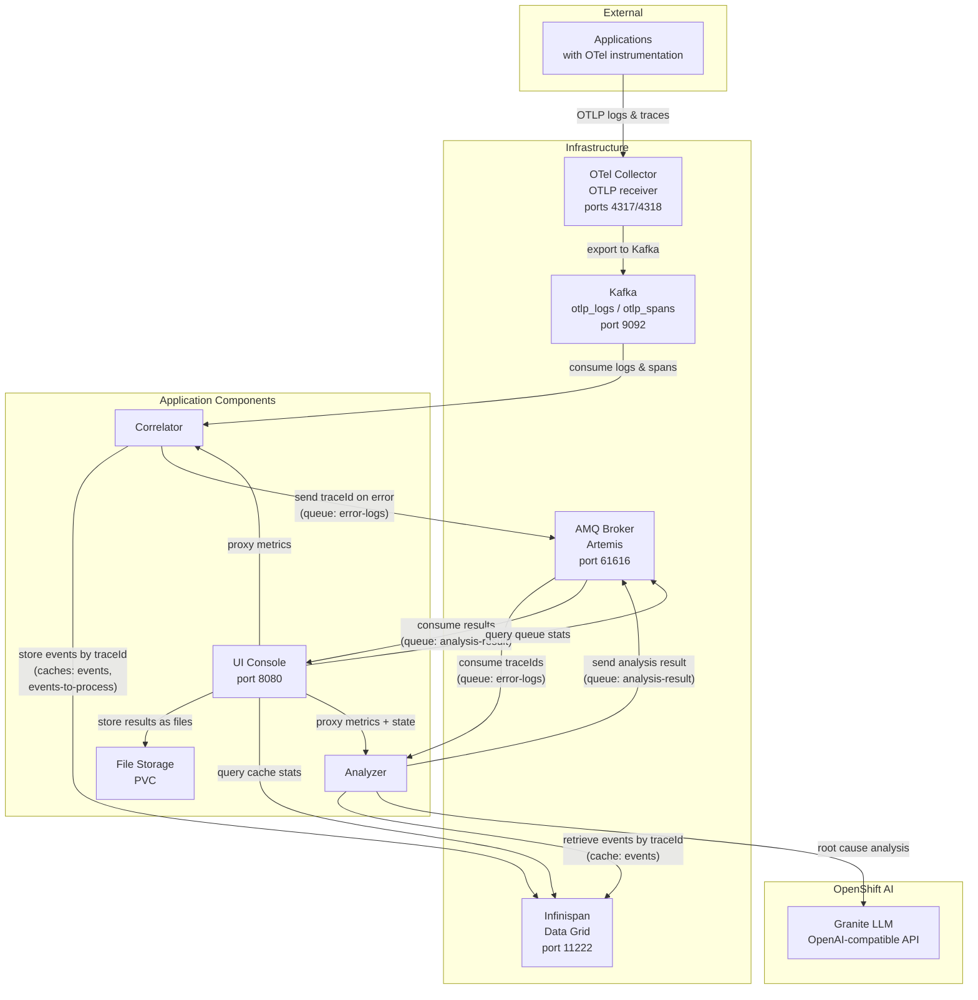
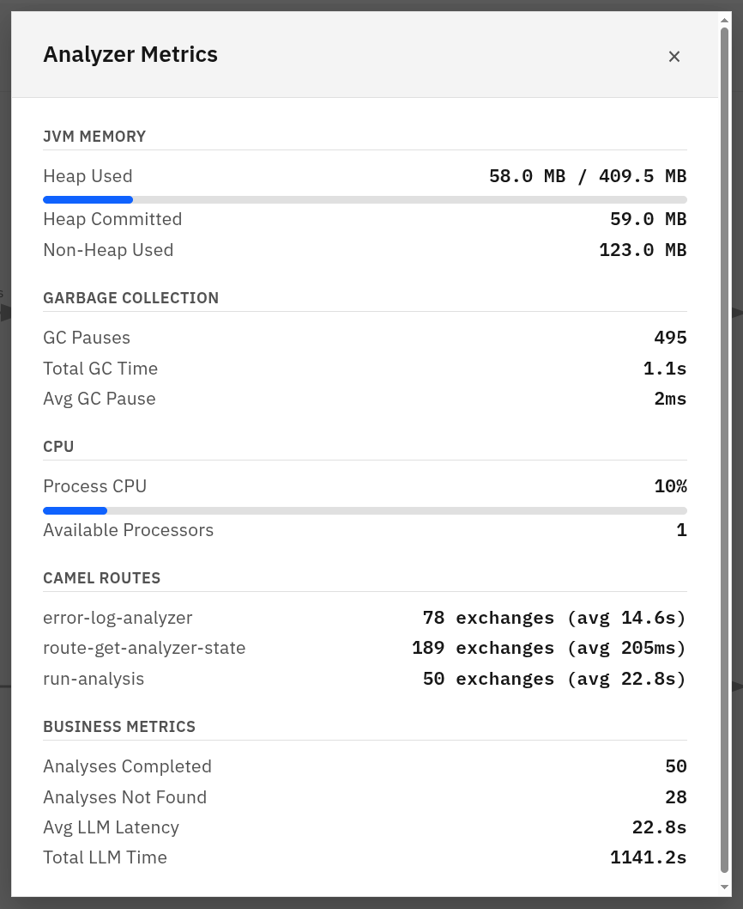
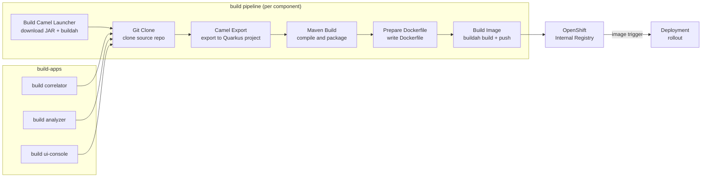
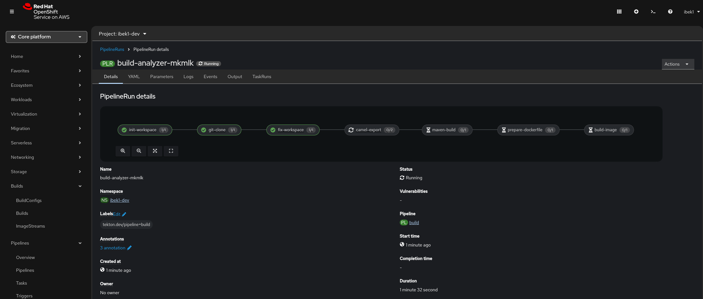
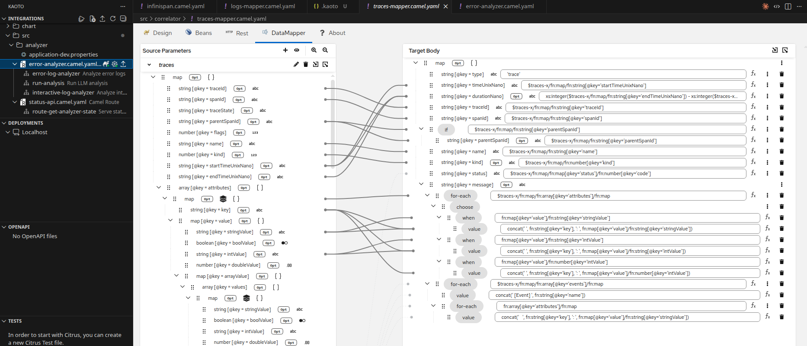

# Technical Details

## Component architecture

The system consists of three Apache Camel applications that form an automated error analysis pipeline:

- The **correlator** consumes OpenTelemetry logs and spans from Kafka, correlates them by traceId in Infinispan, and detects errors. When cached events expire (after a configurable TTL), the traceId is forwarded to a JMS queue for analysis.

- The **analyzer** picks up traceIds from the JMS queue, retrieves the correlated events from Infinispan, sends them to an LLM (OpenAI-compatible API) for root cause analysis, and publishes the result to an output queue.

- The **ui-console** consumes analysis results, stores them as files, and exposes a REST API and web UI for listing results, viewing trace details, and triggering interactive re-analysis with custom prompts.

### Data flow

### Analyzer metrics

The analyzer exposes detailed JVM, Camel route, and business metrics through its metrics endpoint. The UI Console proxies these and displays them in a dedicated panel.

## Build pipeline

The `build` pipeline converts Camel JBang source code into container images deployed on OpenShift:

The **Build Camel Launcher** step downloads the `camel-launcher` JAR from Maven Central or Red Hat GA repository (via `mvn dependency:copy`) and builds it into a container image pushed to the OpenShift internal registry. The version is configurable via the `camel-launcher-version` pipeline parameter (default: `4.18.1.redhat-00016`). The Quarkus platform version used during `camel export` is configurable via the `runtime-version` parameter (default: `3.33.2.redhat-00002`). The **Camel Export** step runs `camel export --runtime=quarkus` using the internally-built camel-launcher image to convert the Camel JBang application into a standard Quarkus Maven project. The **Maven Build** step compiles it into a Quarkus fast-jar. The **Build Image** step uses Buildah to create the container image and push it to the OpenShift internal registry. The `image.openshift.io/triggers` annotation on the Deployment automatically triggers a rollout when a new image is pushed.

## Kaoto DataMapper

The correlator uses [Kaoto](https://kaoto.io/) DataMapper to transform raw OpenTelemetry JSON payloads into the correlated event format stored in Infinispan. Two XSLT transformations are generated by the Kaoto visual editor:

- **Log mapping** (`kaoto-datamapper-4a94acc3.xsl`) — transforms OpenTelemetry log records (`otel-log-record-schema.json`) into the correlated log format (`correlated-log-schema.json`)
- **Trace mapping** (`kaoto-datamapper-8f5bb2dd.xsl`) — transforms OpenTelemetry spans (`otel-span-schema.json`) into the correlated trace format (`correlated-trace-schema.json`)

The Kaoto DataMapper provides a visual drag-and-drop interface for defining field mappings between the source and target JSON schemas, generating the underlying XSLT automatically.

